# ✦ Calculadora de Consola · Bruno S. Alejandro ✦

### Módulo 4 · Fundamentos de programación en JavaScript

---

## Descripción

Aplicación de consola desarrollada como proyecto de evaluación del módulo 3 del bootcamp de **Desarrollo de Aplicaciones Front-End Trainee**. Implementa los fundamentos del lenguaje JavaScript a través de una calculadora interactiva con historial de operaciones.

Combina operaciones matemáticas básicas, estructuras condicionales, ciclos, funciones modularizadas y objetos, siguiendo buenas prácticas de organización y legibilidad del código.

---

## Características

- ✅ Entrada de datos con `prompt()` y salida con `alert()` / `console.log()`
- ✅ Operaciones matemáticas: suma, resta, multiplicación y división
- ✅ Estructuras condicionales (`if / else`, `switch`)
- ✅ Ciclos `for` y `while`
- ✅ Funciones modularizadas para cada operación
- ✅ Funciones que llaman a otras funciones
- ✅ Arreglos con filtrado de elementos (`filter()`)
- ✅ Objetos con propiedades y métodos
- ✅ Recorrido de arreglos de objetos con `forEach()` y `map()`
- ✅ Validación de datos ingresados por el usuario

---

## Tecnologías

 

---

## Estructura del proyecto

```
proyecto-consola-js/
│
├── index.html      # Carga app.js y ejecuta la aplicación
├── app.js          # Lógica completa de la aplicación
├── README.md       # Documentación del proyecto
└── capturas/       # Capturas de pantalla de la app en funcionamiento
```

---

## Cómo ejecutarlo

1. Descarga o clona el repositorio.
2. Abre el archivo `index.html` en tu navegador.
3. Abre la consola (`F12` → pestaña **Console**).
4. Sigue las indicaciones de los cuadros de diálogo (`prompt`).

---

## Funcionalidades por sección

| Sección | Contenido |
|---|---|
| Introducción | Uso básico de `console.log()`, `prompt()` y `alert()` |
| Variables y condicionales | Calculadora con `if / else` y `switch` |
| Arreglos y ciclos | Lista recorrida con `for` y `while`, filtrado con `filter()` |
| Funciones | Operaciones matemáticas modularizadas en funciones |
| Objetos | Arreglo de objetos con métodos, recorrido con `forEach()` y `map()` |

---

## Capturas de pantalla

### Paso 1 · Traductor de emociones

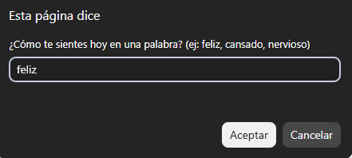 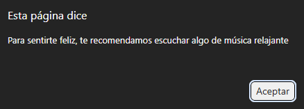

### Paso 2 · Operaciones matemáticas con condicionales

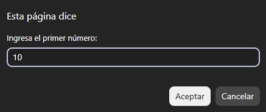 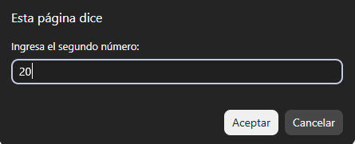
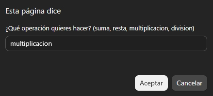 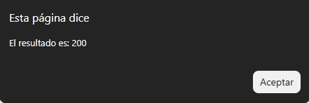

### Paso 3 · Arreglos y ciclos

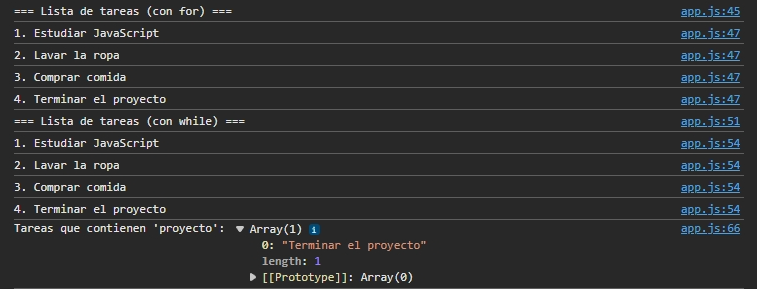

### Paso 4 · Funciones en JavaScript

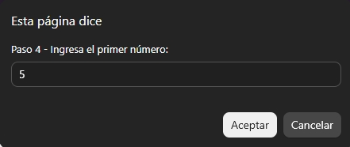 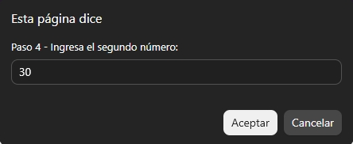
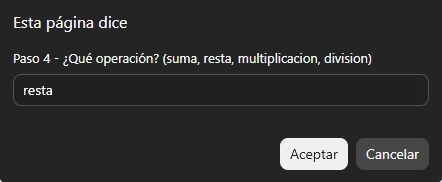 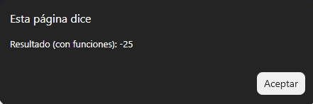

### Paso 5 · Objetos en JavaScript

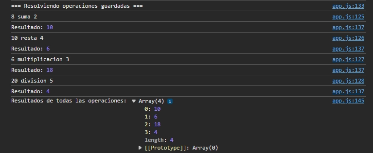

---

## Documentación y análisis del proyecto

El desarrollo se realizó de forma progresiva, siguiendo las 5 lecciones del módulo: primero se practicó la sintaxis básica de JavaScript (`console.log()`, `prompt()`, `alert()`), luego se avanzó hacia el manejo de variables y condicionales, arreglos, funciones y finalmente objetos, integrando todo en una única aplicación de consola.

**Dificultades encontradas y solución:**

- **Codificación de caracteres:** al ejecutar el script por primera vez, los acentos y signos de interrogación se mostraban de forma incorrecta (`¿Cómo`). Se solucionó agregando `<meta charset="UTF-8">` en el HTML y guardando el archivo `app.js` con codificación UTF-8 desde el editor.
- **Resultado `undefined` en una operación:** al implementar la multiplicación y la división, el resultado aparecía como `undefined`. Usando `console.log()` para depurar, se detectó que esos bloques del condicional habían quedado vacíos (sin la operación matemática asignada a la variable `resultado`), y se corrigió completándolos.
- **Validación de división entre cero:** se agregó una condición adicional para evitar que la aplicación intente dividir entre 0, mostrando un mensaje de error en su lugar.

**Aprendizajes principales:**

- La diferencia entre resolver una lógica repetida directamente en bloques `if/else` y modularizarla en funciones reutilizables, lo que hace el código más ordenado y fácil de mantener.
- El uso de `.filter()`, `.forEach()` y `.map()` para trabajar con arreglos de forma más limpia que con bucles tradicionales.
- Cómo estructurar objetos con propiedades y métodos, y cómo `this` permite que un método acceda a los datos de su propio objeto.
- La importancia de depurar con `console.log()` para identificar en qué parte del código se produce un comportamiento inesperado.

---

**© 2026 Bruno S. Alejandro**
